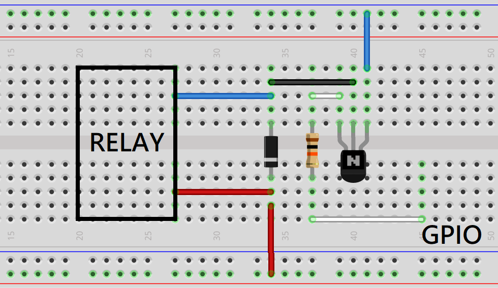
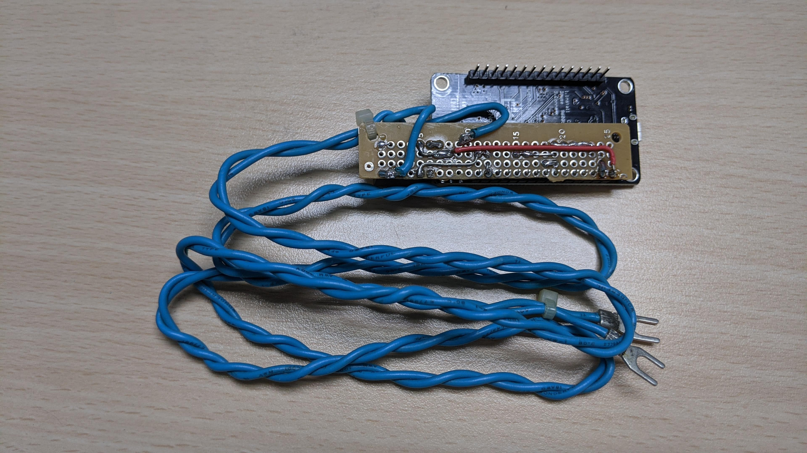
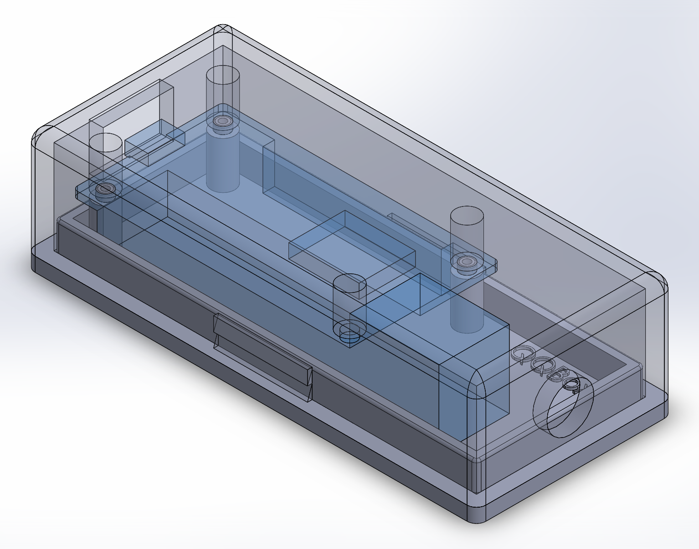
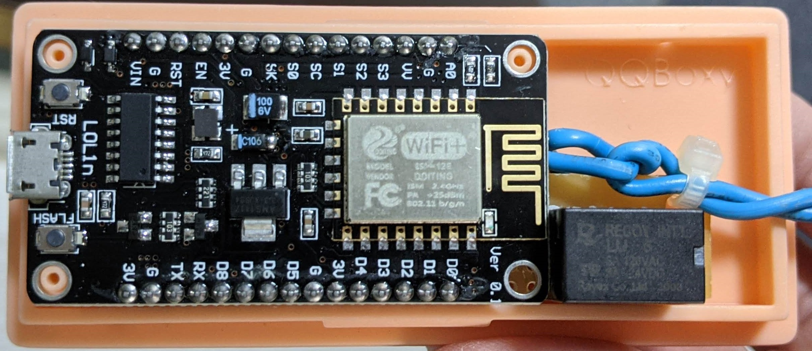
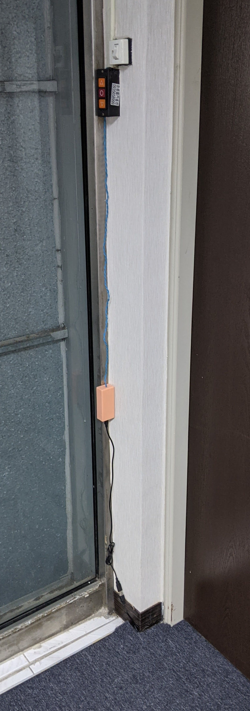

# 鐵捲門繼電器控制

[](https://www.youtube.com/watch?v=W-WDRrXZ9ho)
(請點選圖片以播放影片)

## 韌體程式

> `mqttserver.ino` 此程式有兩種控制方式，兩種方式皆需要進行 Wifi 連線設定。

```
const char *ssid = "YOUR_WIFI_SSID";
const char *password = "YOUR_WIFI_PASSWORD";
```

### MQTT 連接方式

> 使用 `MQTT` 通訊協定，在 `Home Assistant` 智慧家庭平台上，透過 `Eclipse Mosquitto` 伺服器的帳密來進行連接。

```
const char *mqtt_server = "YOUR_MQTT_SERVER";
const char *mqtt_name = "YOUR_MQTT_SERVER_NAME";
const char *mqtt_password = "YOUR_MQTT_SERVER_PASSWORD";
```

### 區網網頁 連接方式

> 直接由虛擬 `IP` 連接到輸入密碼的網頁，透過輸入正確的密碼來控制。

```
const char *door_password = "DOOR_PASSWORD";
```

## 硬體製作

### 使用材料

* ESP8266 (NodeMCU ESP-12E Module) 100元
* 電阻 1元
* 電晶體 NPN 1元
* 二極體 1N4001 1元
* 繼電器 10元
* PCB板 3元

### 電路設計



### 電路焊接



### 外殼設計



### 裝配結果



### 實地成果


